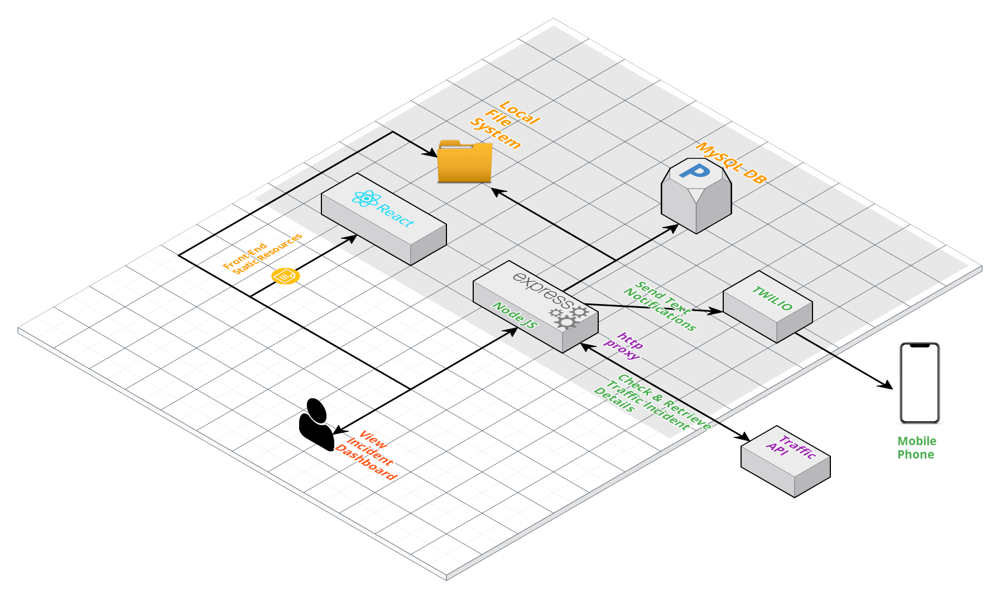
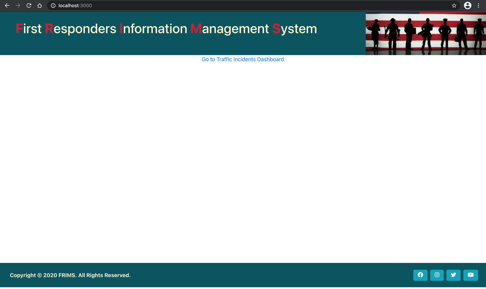
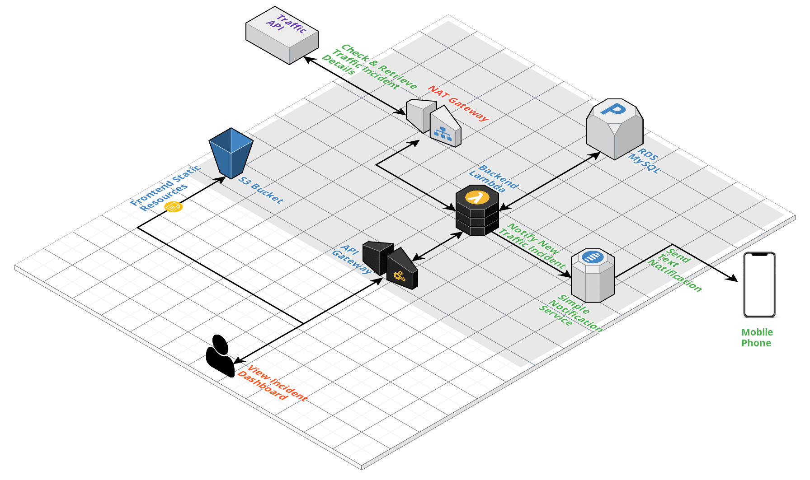

# SNHU CAPSTONE PROJECT - FEB, 2021

    ~ Stanley Alex Devadoss

For Capstone Project, a web application to monitor and notify traffic incidents is developed and tested. Following sections provide installation instructions for development and production environments.

## DEVELOPMENT ENVIRONMENT SETUP

### DB SETUP

    1. Install MySQL database in the local machine or development server directly or using a Docker container.
    2. Create a Schema User named 'inc-info'
    3. Create DB tables by executing 'db/scripts/db_setup_scripts.sql' in 'inc-info'

### APPLICATION SETUP

    1. Install latest NPM & Node JS versions
    2. Checkout code from Github to a local folder. GIT Location: https://github.com/StanleyAlex/snhu-capstone-project. 
       NOTE: 
            - If you are using http, a proxy may be needed. 
            - If you are using ssh, please refer to the instructions in this page to setup SSH access to the Git repository - https://support.atlassian.com/bitbucket-cloud/docs/set-up-an-ssh-key/
    3. For development, either Webstorm or VS Code is recommended. Setup the project in one of these Editors using the checked out code.
    4. Using integrated terminal in the Editor, go to 'api' folder and run 'npm i' to install npm libraries for 'api' module.
    5. Start the backend server using the command 'npm run start-dev'
    5. Using integrated terminal in the Editor, go to 'ui' folder and run 'npm i' to install npm libraries for 'ui' module.
    6. Start the frontend server using the command 'npm run start'
    7. If installation goes through successfully, following UI Landing page must be loaded using the URL - http://localhost:3000/
    8. Further code changes must be code-reviewed and committed to the Git Repo. As a best practice, create a separate branch for each new functionality developed.

## PRODUCTION ENVIRONMENT SETUP

### DB SETUP

    1. Configure AWS RDS MySQL database in the production environment
    2. Create a Schema User named 'inc-info'
    3. Create DB tables by executing 'db/scripts/db_setup_scripts.sql' in 'inc-info'

### APPLICATION SETUP

    1. Application setup for Production Environment is recommended to be setup using AWS. Please note that additional components like AWS Cloudfront may be required for security and caching purposes. 
    2. AWS infrastructure setup will be handled by Architects and Infrastructure teams.
    3. Following are the AWS components used by FRIMS application
        - S3 bucket to store UI static resources 
          NOTE: S3 will be configured to run as static web server to server static files
        - API Gateway to access Lambda function
        - Lambda function to process User requests
        - AWS RDS to store User data
        - NAT Gateway to securely access external API services
        - SNS to send text notifications
    4. Once the AWS environment is setup, use a build & deployment tool like Jenkins to build UI and API module code.
    5. Deploy UI code to S3 bucket and API code to Lambda function
    6. If the entire infrastructure setup was performed correctly, the application must be accessible using the URL - https://frims.capstone.snhu.edu/